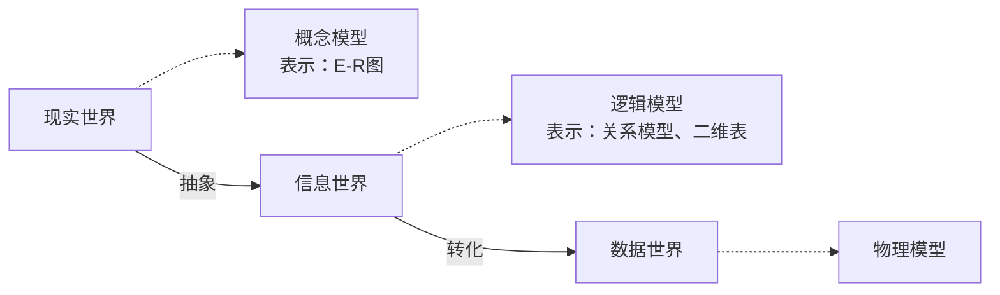

# 数据库的基本概念

数据（Data）：描述事物的**符号记录**为数据。数据是数据库中存储的基本对象。

数据库（DB）：长期存储在计算机内，**有组织、统一管理、可共享**的大量数据的集合。

数据库管理系统（DBMS）：介于用户与操作系统之间的系统软件。核心功能有：

1. 数据定义功能（DDL）：建库、建表、定义约束；
2. 数据组织、存储和管理；
3. 数据操纵功能（DML）：增删改查；
4. 数据库的事务管理与运行管理：并发控制、安全控制、完整性检查；
5. 数据库的建立和维护：备份、恢复、重组。

数据库系统（DBS）：Hardware + Software + DB + User + DBA。

1. 硬件：提供物理设备、大容量存储与运行环境。物理设备包括服务器，内存，硬盘，存储，网络等。
2. 软件：OS提供基础环境；DBMS统一管理、控制、维护数据库；应用软件面向用户使用；开发工具辅助开发。
3. 用户包含终端用户，程序员，系统分析员，数据库设计人员等。
4. DBA负责安装、配置、监控 DBMS 与数据库；管理数据库**安全性**：分配权限、账户管理、防止非法访问；维护**数据完整性**与数据一致性；日常备份、故障恢复、灾难处理；数据库性能优化、存储空间管理；控制并发访问、解决冲突；制定数据库管理制度、维护数据安全。

数据库技术发展：人工管理 -> 文件系统 -> 数据库系统。

# 数据模型（Data Model）

**作用：** 对现实世界数据特征的抽象工具。

**组成要素：**

1. 数据结构：描述数据库的组成对象以及对象之间的联系，是对系统静态特性的描述。
2. 数据操作：主要有查询和更新两大类，是对系统动态特性的描述。
3. 数据的完整性约束条件：一组完整性规则，保证数据正确、合法、有效。

**分类：**

1. 概念模型：以真实世界的关系语义为基础，将数据需求抽象为业务对象和业务流程，即数据库设计。
2. 逻辑模型：按计算机系统的观点对数据建模，主要用于DBMS的实现。
3. 物理模型：描述数据在系统内部的表述方式和存取方法。用记录、字段、数据表描述信息。

**信息世界三大抽象层次：**

## 概念模型

### 信息世界的基本概念

1. **实体（Entity）**：客观存在并可相互区分的事物。可以是具体对象或是抽象概念。
2. **属性（Attribute）**：实体所具有的某一特征。一个实体由若干属性描述。
3. **码/**主键**（Key）**：能唯一标识一个实体的属性或属性集。
4. **联系（Relationship）**：实体之间的关联关系。
5. 域（Domain）：属性的取值范围。
6. 实体型（Entity Type）：用实体名 + 属性名集合抽象刻画同类实体。
7. 实体集（Entity Set）：同一类型实体的集合。

### 实体之间的关系（联系的类型）

**两个实体**：

1. 一对一（`1:1`）：实体集 A 中的一个实体，最多与实体集 B 中的一个实体对应。
2. 一对多（`1:n`）：实体集 A 中的一个实体，可以与实体集 B 中的多个实体对应；但 B 中一个实体最多只与 A 中一个实体对应。
3. 多对多（`n:n`）：实体集 A 中的一个实体，可以与 B 中多个实体对应；B 中一个实体也可以与 A 中多个实体对应。

**多个实体**：

1. 一对一对一（`1:1:1`）：A 中一个实体 → 最多对应 B 中一个、C 中一个。
2. 一对一对多（`1:1:n`）：A 中一个实体 → 最多对应 B 中一个、C 中多个。
3. 一对多对多（`1:m:n`）：A 中一个实体 → 最多对应 B 中多个、C 中多个。
4. 多对多对多（`m:n:p`）：A 中多个实体 → 最多对应 B 中多个、C 中多个。

数据库设计中，多元联系一般会拆成多个二元联系 + 中间关联表。

### 概念模型的一种表示方式：实体-联系图（E-R图）

E-R 图提供了表示实体型，属性和联系的方法。

1. 实体型用矩形表示，框内写明实体名；
2. 属性用椭圆形表示，并用无向边将其与相应的实体型连接起来；
3. 联系用菱形来表示，框内写明联系名，并用无向边分别与相关实体型连接起来，同时在无向边旁标上联系的类型。

## 逻辑模型

发展进程：

1. 层次模型、网状模型；
2. 关系模型（主流）；
3. 新型数据模型：键值对数据模型，文档数据模型，图数据模型，时序数据模型，时空数据模型，流数据模型，多媒体数据模型等。

### 关系模型

关系模型的数据结构：由一组关系组成，每个关系的数据结构是一张**规范化的**二维表。最基础的规范条件：不允许表中还有表。

关系数据与一般表格的术语对比：

1. 关系/关系名/关系模式 = 二维表/表名/表头；
2. 元组 = 记录或行；
3. 属性/属性名/属性值 = 列/列名/列值；
4. 分量 = 一条记录中的一个列值；
5. 非规范化关系 = 表中有表。
关系模型的数据操纵：是集合操作，操作对象和操作结果都是关系，包括CRUD。

关系模式的完整性约束：

1. 实体完整性：主键非空、唯一；
2. 参照完整性/引用完整性：外键匹配主表主键或为空；
3. 用户定义的完整性：业务专属自定义规则。常见约束有数据类型，长度限制，取值范围，唯一约束，非空约束等。

优点：
1. 建立在严格的数学概念的基础上；
2. 概念单一：实体之间的联系用关系来表示，对数据的检索和更新结果也是关系；
3. 存取路径对用户是透明的：具备更高的数据独立性和安全保密性，简化了数据库开发建立的工作。

缺点：查询性能不如层次模型和网状模型，需要对用户的查询请求进行优化。

# 数据库系统的三级模式结构（内部架构）

## 基本概念

模式（Schema）：对数据库中数据**整体逻辑结构和特征**的描述。

实例（Instance）：模式的具体值，反映数据库某一时刻的状态，随数据库中数据的更新而变动。

## 三级模式结构

1. 外模式（External Schema，子模式/用户模式）：面向普通用户，**局部数据视图**；一个数据库可以有**多个**外模式。
2. 模式（Schema，逻辑模式）：整个数据库**全局逻辑结构**，唯一，DBA 视图。
3. 内模式（Internal Schema，存储模式）：描述数据物理存储结构、存储方式；一个数据库**只有一个**内模式。

## 两级映像与数据独立性

1. 外模式 / 模式映射：全局逻辑改，用户视图不变，应用程序不用改。保证**逻辑独立性。**
2. 模式 / 内模式映射：物理存储改变，全局逻辑不变，程序不用改。保证**物理独立性。**

# 数据库系统的体系结构（外部架构）

1. 集中式：所有数据、DBMS、应用都在**一台主机**。缺点是单点故障、压力大。
2. C/S：客户端负责界面、业务处理；服务器端负责数据库管理、数据存储。分工明确，负载分散。
3. 并行：由多处理机、多磁盘并行协作，并行执行数据操作，提升运算速度与并发处理能力，适用于海量数据与高性能需求场景。
4. 分布式：数据分散存储在多个场地，逻辑上统一整体。各节点自治，又可协同访问全局数据。适合跨地域、大数据场景。
5. 云：依托云计算平台提供的数据库服务，实现资源弹性伸缩、云端托管运维、自动备份容灾，低成本、高可用、跨网络访问。
